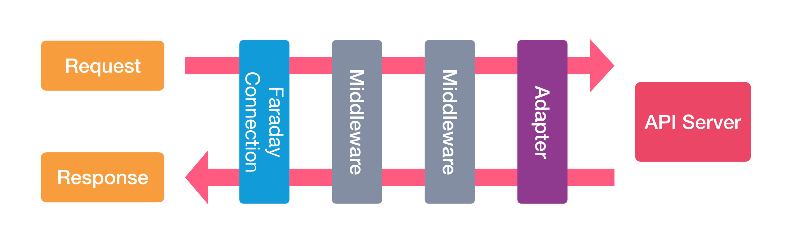

# Wrap and Roll: Wrapping APIs with Faraday and VCR (Part I)

In case you have interacted with external APIs, you have likely noticed that not all SDKs or connections are created equally, _more often_ than not they can be confusing and hard to deal with, but that can and will change when you wrap, encapsulate and abstract the behavior of an API.

It might seem like a long blogpost, but I've decided to follow step by step on how a wrapper is devised, from studying the API to understanding how it will work. For that same reason, I've decided to make this a two-part blog post! In this first part we'll talk about the wrapping logic, in the next post will be about the testing!

## Intro
Here you'll learn the basics of wrapping and what this means from a general standpoint, why does it make sense? why does it make it easier? and most importantly... how do I do it?

Well, in this regard we'll be using two really cool gems, Faraday and VCR. Faraday is an HTTP client library abstraction layer that can be used with many adapters (you can choose the one you like the most!), it uses middleware to process requests and responses from the web and can be very intuitive to use. 

VCR on the other hand is our ally on the testing front of things, it can record your HTTP interactions and replay them when running tests, so you'll have accurate and deterministic tests!

So let's start by talking about Faraday!

## Why Faraday?
Faraday can save lots of time by providing already developed tools while using the adapter of your choice, instead of directly using _Net::HTTP_, _HTTPClient_, and so forth, we can instead rely on the features already provided to build dryer code and abstract the ins and outs of how a HTTP request is made.

Just by making a simple setup, we have access to _keep-alive connections_, _parallel requests_, _automatic parsing_ (even using your desired parser!), _customization of how the request/response cycle_ is handled via _middleware_ and so on!

At the end of the day, it ends up being a quality-of-life upgrade for creating connections to APIs.

Remember to check the [Faraday Docs](https://lostisland.github.io/faraday/#/) for more detailed info!

## What is a Wrapper
So... what _is_ a wrapper? 

The point of a wrapper is to make the life of a developer easier, it facilitates the way you interact with an API and its protocols, and it encapsulates its behavior making it easier to understand and _test_ them. When you use a simple API your life feels like a breeze, no problems, no setbacks, no head scratching, only manual labor to set up a _lot_ of different requests, but when there is an overly complicated API, with **endless** amounts of endpoints and bodies, protocols here and there... it'll make you rethink your life choices on the area you chose as a career, a wrapper ends up being a package that _wraps_ the API calls in simple to understand and use class or classes, without relying on an adapter to set configurations and initiate a different connection every time you need to create a different endpoint, it also makes it easier to automate responses in your projects.

When you create your wrapper you'll define the set of functions you'll have, you can define the endpoints that will be used and adapt the way you call them to the reality of your application, so it can also substitute an existing SDK that has much more tools than you need, or maybe the tools provided are not useful enough!

TL;DR: 
> In that line, an API wrapper is a language-specific package or kit that encapsulates multiple API calls to make complicated functions easy to use. It helps developers call various APIs without the need for their real-time interaction. As such, wrappers can be used to automate API-reliant processes. Since APIs allow users to access a set of specific standard functions, API wrappers can help you integrate multiple API calls into a single service.
>
> -- <cite> https://rapidapi.com/blog/api-glossary/api-wrapper/ <cite>

## Basic Setup
For this example, we'll be wrapping the **PokeAPI**! It's a simple-to-use API for accessing all information about the Pokemon game or anime, our application will just be used to store locally what we want, think of it like a local pokedex if you will.

First, let's create the Rails app without a testing framework
```console
$ rails new pokedex -T
```
There we have it, the skeleton of our Pokedex!

The next step is to install the gem we will need, in this case, the Faraday gem
```rb
# Gemfile.rb
gem 'faraday'
```
Install the gems using
```console
$ bundle install
```
Done! Let's start creating our wrapper!

Here we'll follow rails conventions that are already used for controllers, models, mailers, service and query objects, and such, so we'll create an `app/apis` folder, inside it there will be the folder containing all logic for the API wrapper, let's call it `poke_api`.

Since we'll be using the V2 of the PokeApi is really important to organize the versions of your used APIs in different folders/modules, so when a new one is released you'll just need to create a new folder and follow the same steps!

Finally, to represent the connection and contain the code per se, we'll create a `client.rb` file inside `app/apis/poke_api/v2`, but feel free to name it however you see fit. The soul of our wrapper resides here!

## Understanding the API and Creating our DB
Before effectively coding let's explore the API, its endpoints, and what will be used. Every time you make an API Wrapper you need to know and study the API, otherwise how will it be useful? 

In the docs, we learn that this is a **_consumption-only_ API**, meaning there is only the _GET_ method available for its resources, either way, we'll learn about using the _POST_ method later. There is also no need for authentication, all resources are readily available, and no rate limit is imposed!

We'll tacke at three resources/endpoints: _**Pokemons**_, _**Berries**_ and _**Items**_, they can are defined, respectively, as
```
-> GET https://pokeapi.co/api/v2/pokemon/{id or name}/ 
-> GET https://pokeapi.co/api/v2/berry/{id or name}/
-> GET https://pokeapi.co/api/v2/item/{id or name}/
```

For the **Pokemon** endpoint we'll want to save the following information:
  * **Name**: _String_
  * **Height**: _Integer_
  * **Weight**: _Integer_

For the **Berry** endpoint we'll want to save the following information:
  * **Name**: _String_
  * **Size**: _Integer_
  * **Smoothness**: _Integer_

For the **Item** endpoint we'll want to save the following information:
  * **Name**: _String_
  * **Cost**: _Integer_

Let's create simple models and migrations to represent them in our DB!

```rb
## Migrations
class CreatePokemons < ActiveRecord::Migration[7.1]
  def change
    create_table :pokemons do |t|
      t.string :name
      t.integer :height
      t.integer :weight

      t.timestamps
    end
  end
end


class CreateBerries < ActiveRecord::Migration[7.1]
  def change
    create_table :berries do |t|
      t.string :name
      t.integer :size
      t.integer :smoothness

      t.timestamps
    end
  end
end

class CreateItems < ActiveRecord::Migration[7.1]
  def change
    create_table :items do |t|
      t.string :name
      t.integer :cost

      t.timestamps
    end
  end
end

## Models
class Pokemon < ApplicationRecord
end

class Berry < ApplicationRecord
end

class Item < ApplicationRecord
end
```
We won't deal with validations here since it's not the objective, but don't forget to do it!

Now that we have a basic understanding of the endpoint and what information we'll extract, let's start wrapping it up!


## Wrapping (the API) up
Firstly let's understand the basic functionality of the Faraday gem.

Even though we can create different functions, each with a direct call to the API via a quick request with `Faraday.get` for example, there is a better and _recommended_ option. The idea here is to create a [Faraday Connection](https://lostisland.github.io/faraday/#/getting-started/quick-start?id=faraday-connection), an object that represents the API and will be responsible for calling it.

This connection by itself will allow us to define default _headers_, _params_, _timeouts_, a _base URL_ and _middleware_! This will save us some time later and prevent some headaches. We can call this connection using HTTP verbs and passing the endpoint and body, even though Faraday accepts a lot of verbs here we will only use the `GET` and `POST` (we will imagine a _POST_ endpoint for examples later)

We'll create the object and pass it some parameters and options in the middleware defined in the yielded block.

_The soul of the client_ will reside inside a `client` method as such:
```rb
# client.rb

require 'faraday'

module PokeApi
  module V2
    class Client
      POKE_API_BASE_URL = 'https://pokeapi.co/api/v2/'

      private

      def client
        @client ||= begin
          options = {
            open_timeout: 10,
            read_timeout: 10
          }
          Faraday.new(url: POKE_API_BASE_URL, **options)
        end
      end
    end
  end
end

```

Okay! Let's dissect what we did here, then we will include more stuff. 

We created a private method called `client` that [memoizes](https://en.wikipedia.org/wiki/Memoization) a **Faraday Connection** to be used in the endpoint methods we will define later, we created an `options` hash to define a timeout option to both open and read, the best values will all depend on your application, but since we will use the default Faraday adapter [Net::HTTP](https://ruby-doc.org/3.3.0/stdlibs/net/Net/HTTP.html) we know that the default initial timeout for [open](https://ruby-doc.org/3.3.0/stdlibs/net/Net/HTTP.html#attribute-i-open_timeout) and [read](https://ruby-doc.org/3.3.0/stdlibs/net/Net/HTTP.html#method-i-read_timeout-3D) it is _60 seconds_, but let's use a lower value, we don't want to wait up to a whole minute to get our response. 

Next, we instantiated a Faraday Connection with `.new` passing the `BASE URL` and the `options` hash, and there we have it, a way to call the PokeAPI! But there is more!

### Middleware

Let's talk about the middleware. The real power of the Faraday Connection comes from this stack, it hooks into the **_request/response cycle_** and modifies it, with it we can add an authentication header, parse JSON responses, and log the request and response while filtering sensitive info, raise errors for 4xx and 5xx and so on!

With this image from the [**_How it works_**](https://lostisland.github.io/faraday/#/middleware/index?id=how-it-works) section in the Faraday Docs we have the basic idea, for you curious developer on the ins and outs of the functionality



For this application we only want the parsing, logging without filtering if we need to debug (there is no sensitive info here), and raising of error when there is a problem, so our connection ends up like this
```rb
def client
  @client ||= begin
    options = {
      request: {
        open_timeout: 10,
        read_timeout: 10
      }
    }
    Faraday.new(url: POKE_API_BASE_URL, **options) do |config|
      config.request :json
      config.response :json, parser_options: { symbolize_names: true }
      config.response :raise_error
      config.response :logger, Rails.logger, headers: true, bodies: true, log_level: :debug
    end
  end
end
```
With `config.request :json` and `config.response :json, parser_options: { symbolize_names: true }` we are expecting a JSON request body (You can actually pass a hash and it will be parsed to JSON) and JSON responses, for the response the parser will parse the keys as symbols, which is _really_ convenient. Of course, you could use a different parser instead of the Rails default, like [OJ](https://github.com/ohler55/oj), in this case just follow this [doc](https://lostisland.github.io/faraday/#/middleware/included/json?id=using-custom-json-decoders), it's pretty easy! 

With `config.response :raise_error` Faraday will raise a `Faraday::Error` exception if an HTTP response returns with a **4xx** or **5xx**, which can help understand the flow of the code and deal with them with rescue clauses, this end up being a personal preference, but I do recommend using it, this way the wrapper can rescue them and raise a custom general ApiError for example, it will call the attention to the error, which is vital IMHO, more on that in the next part of this blog post when we deal with error and testing.

Last but not least, with `config.response :logger, Rails.logger, headers: true, bodies: true, log_level: :debug`  we will log to the Rails logger the request and the response body and headers, it can also be configurated to filter sensitive info like secret keys and confidential information, it's not the case here, but just a heads up! With logging you can debug any problems involving the `request/response cycle`, I recommend always using this middleware.

You can get to know more about all middlewares in their [middleware official docs](https://lostisland.github.io/faraday/#/middleware/index?id=middleware), you can see the best options and adapters for your case!

Important information, even though in the docs there is no mention of the importance of the middleware order, there is a common pitfall that makes you unable to log errors, so watch out! more info in this [section](https://mattbrictson.com/blog/advanced-http-techniques-in-ruby#aside-faraday-middleware-configuration-pitfalls) of a recommended blogpost by the Faraday devs.

## Adding Endpoints to the Wrapper

Okay! Great work catching up until now! We can finally make our endpoints, first let's make a private request method that will always call the connection with the desired HTTP verb, endpoint, and body.

```rb
private

def client
  #...
end

def request(http_method:, endpoint:, body: {})
  response = client.public_send(http_method, endpoint, body)
  {
    status: response.status,
    body: response.body
  }
end
```

What is happening here? Well, this private method will be used in our endpoint methods! With it, we will use [public_send](https://apidock.com/ruby/Object/public_send) to invoke our desired verb (which to the Faraday connection is used as a method), and with it sends our endpoint and params as its arguments. 

This means:
```rb
# This:
request(:get, 'pokemon/pikachu', { stuff: "stuff" })

# Translates to:
client.get('pokemon/pikachu') do |request|
  request.body = { stuff: "stuff" }
end

## => GET https://pokeapi.co/api/v2/pokemon'
## => body: { "stuff": "stuff" }
```
When we get our response it will be stored in a hash containing the status and the body, if there is any problem (4xx or 5xx) an error will be raised, so we will rescue it

```rb
def request(...)
# ...
rescue Faraday::Error => e
  puts e.inspect
end
```

For now, we will only print the result, but there will be better treatment in the next part of this blog!

You will see in a second how all of this is useful! Let's create now our first method for the Pokemon endpoint!

```rb
# Let's name it accordingly
def get_pokemon(pokemon_name)
  # Now we only call the request method
  request(
    http_method: :get,
    endpoint: "pokemon/#{pokemon_name}"
  )
end
```
Done.

We have a functioning wrapper! Let's manually test it with the rails console before moving to the other endpoints.
 
```console
$ connection = PokeApi::V2::Client.new
=> #<PokeApi::V2::Client:0x00007f150d9f81d8>

$ response = connection.get_pokemon('spirigatito')
=> GET https://pokeapi.co/api/v2/pokemon/sprigatito
   User-Agent: "Faraday v2.9.0"
   Status 200
   date: "Thu, 21 Mar 2024 17:41:53 GMT"
   content-type: "application/json; charset=utf-8"
   connection: "keep-alive"
   ...
   { // Response body is here }

$ response[:status]
=> 200

$ response[:body]
=> {
      abilities: [...],
      base_experience: nil,
      cries: {...}
      height: 4
      moves: [...]
      ...
   }

$ response[:body][:name]
=> "spirigatito"
```

Pretty cool, right? Even though it demanded some heavy work to comprehend what happens in the back end now that we have a functioning wrapper we can get any Pokemon we want! 

That is the gist of it, we create a connection, call the desired method that represents an endpoint, and access it as a hash when we get a response!

But what if we search for a Pokemon that does not exist?

```
$ response = connection.get_pokemon('agumon')
=>  User-Agent: "Faraday v2.9.0"
    Status 404
    date: "Thu, 21 Mar 2024 17:57:20 GMT"
    ...
    Not Found
    the server responded with status 404
    -> nil

$ response
=> nil
```
The error is rescued and printed, there are different ways to save and handle a "negative" response, but for now, that will do, let's create our next endpoints!

```rb
# client.rb
def get_berry(berry_name)
  request(
    http_method: :get,
    endpoint: "berry/#{berry_name}"
  )
end

def get_item(item_name)
  request(
    http_method: :get,
    endpoint: "item/#{item_name}"
  )
end
```
Simple, right? This pattern keeps on coming back each time you make a new method, and the way you call it is the same as mentioned before! Of course, we are dealing with the GET verb, surely the other verbs are hard to grasp... Well, no!

Let's imagine that this API accepts a post request that registers a new Pokemon of your creation, let's use the same endpoint as the GET Pokemon one, we just need a body and to use the POST verb

```rb
# client.rb
def create_pokemon(params)
  request(
    http_method: :post,
    endpoint: '/pokemon',
    body: {
      name: params[:pokemon_name],
      height: params[:pokemon_height],
      weight: params[:pokemon_weight],
      locations: {
        # ...
      }
    }
  )
end
```
That's it! If it was a real endpoint we just have to call like we did before, but using a hash as an argument, the body would be parsed and converted to JSON and it would be done! If your wrapper API has a lot of POST methods with lots of bodies you could even make a module with request bodies and then call it, in this example, it would be something like:
```rb
def create_pokemon(params)
  ...
  body: RequestBodies::Pokemons.create_pokemon(params)
end
```
Neat and organized, as all things should be :D


## What now?

Well, now that we have a functioning wrapper we can do whatever we want, in this application we could use a callable service approach, it would call the wrapper, get its response, and use it to save the information to our DB. Since it's not the focus of this blog post, I'll write an example and leave it in the repository for you to read if you want, but just for shows, it would be something like

```rb
# app/services/application_service.rb
class ApplicationService
  def self.call(...)
    new(...).call
  end
end

# app/services/pokemons/get.rb
module Pokemons
  class Get < ApplicationService
    def initialize(pokemon_name, connection)
      @pokemon_name = pokemon_name
      @connection = connection
    end

    def call
      @connection.get_pokemon(@pokemon_name)
    end
  end
end

# app/services/pokemons/save.rb
module Pokemons
  class Save < ApplicationService
    def initialize(pokemon_name)
      @pokemon_name = pokemon_name
    end

    def call
      response = Pokemons::Get.call(@pokemon_name, faraday_connection)

      pokemon = Pokemon.new(
        name: response[:body][:name],
        height: response[:body][:height],
        weight: response[:body][:weight]
      )

      pokemon.save!
    end

    private

    def faraday_connection
      @faraday_connection ||= PokeApi::V2::Client.new
    end
  end
end
```
```console
# Rails Console

$ Pokemons::Save.call('sprigatito')
=>  GET https://pokeapi.co/api/v2/pokemon/sprigatito
    User-Agent: "Faraday v2.9.0"
    Status 200
    date: "Thu, 21 Mar 2024 18:30:10 GMT"

      TRANSACTION (0.1ms)  begin transaction
      Pokemon Create (0.4ms)  INSERT INTO "pokemons" ("name", "height", "weight", "created_at", "updated_at") VALUES (?, ?, ?, ?, ?) RETURNING "id"  [["name", "sprigatito"], ["height", 4], ["weight", 41], ["created_at", "2024-03-21 18:30:10.376862"], ["updated_at", "2024-03-21 18:30:10.376862"]]
      TRANSACTION (0.1ms)  commit transaction

$ Pokemon.last
=>  id: 1,
    name: "sprigatito",
    height: 4,
    weight: 41,
    created_at: Thu, 21 Mar 2024 18:30:10.376862000 UTC +00:00,
    updated_at: Thu, 21 Mar 2024 18:30:10.376862000 UTC +00:00>
```
Again, that's just an overengineered use example, remember to always use the best for your needs! But if you're curious about the callable way, [read this blog post!](https://blog.codeminer42.com/this-is-the-way-the-callable-way/)


## Conclusion
Today we learned how effective it is to have your wrapper, you now can have control over the APIs you choose to work with! Less headaches, and more time to take naps, all thanks to Faraday! We saw how powerful a Faraday Connection is, with its middlewares that hook into the request/response cycle and facilitate the heavy lifting of configuration and parsing. Don't worry about memorizing all this information, the best way to learn is to understand what you are reading and consult documentation and blog posts when needed, think of all this as a new skill in your toolbox!

Next time we talk we will study how to test this wrapper using VCR and discuss why we are using VCR instead of Webmock, we will create the tests and compare them with testing with real requests all the time. See you in the next one!

Check out the source code for this blogpost [here](https://github.com/morfenza/blogpost_wrap_and_roll).

> No one knows what the future may hold, 
> especially not us! So enable your code to 
> _rock-n-roll_: to _“rock on"_ when it can,
> to roll with the punches when it must.
>
> -- <cite>The Pragmatic Programmer (2th ed.). (2019), p. 49</cite>

Cover Photo from <a href="https://unsplash.com/pt-br/@anagrave?utm_content=creditCopyText&utm_medium=referral&utm_source=unsplash">Ana Grave</a> @ <a href="https://unsplash.com/pt-br/fotografias/uma-foto-em-preto-e-branco-de-um-homem-tocando-guitarra-eletrica-em-dupla-exposicao-gHcWaeldgtQ?utm_content=creditCopyText&utm_medium=referral&utm_source=unsplash">Unsplash</a>
 