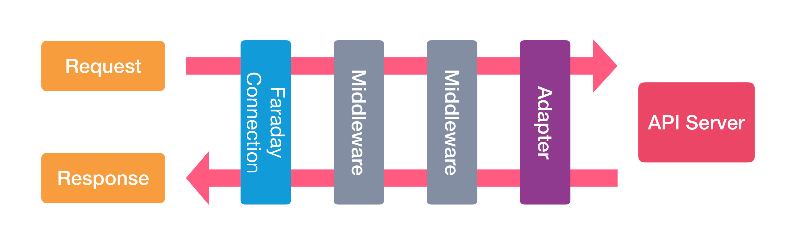

# Wrap and Roll: Wrapping APIs with Faraday and VCR (Part I)

In case you have interacted with external API's, you'll likely notices that not all SDKs ou connections are created equally, mostly _often_ than not they can be confusing and hard to deal with, but that can and will change when you wrap, encapsulate and abstract the behaviour of an API.

It might seem like a long blogpost, but I've decided to follow step by step on how a wrapper is devised, from studying the API to understanding how it will work. For that same reason I've decided to make this a two part blogpost! In this first part we'll talk about the wrapping logic, the next post will be about the testing!

## Intro
Here you'll learn the basics of wrapping and what this means from a general standpoint, why does it makes sense? why does it makes it easier? and most important.. how do I do it?

Well, in this regard we'll be using two really cool gems, Faraday and VCR. Faraday is a HTTP client library abstraction layer that can be used with many adapter (choose the one you like the most!), it uses adapter and middlewares to process request/responses from the web and can be very intuitive to use. VCR on the other hand is our ally on the testing front os things, it can record you HTTP interactions and replaying it them when running tests, so you'll have accurate and deterministic tests!

So let's star by talking about faraday!

## Why Faraday?
Faraday saves a lot of time by providing already develop tools while using a adapter of choice, instead of directly using Net::HTTP, HTTPClient and so forth we can instead rely on the features already provided to build dryer code and abstract the ins an outs of how a HTTP request are maide.

Just by installing the gem we can already have access to keep-alive connections, parallel requests, automatic parsing (even using your desired parser!), customization of how the request/response cycle is handled via middle and so on!

At the end of the day it end up being a quality of life upgrde to directly creating connection.

## What is a Wrapper
https://docs.veracode.com/r/c_about_wrappers
https://rapidapi.com/blog/api-glossary/api-wrapper/

So what _is_ a wrapper? The point of a wrapper is to make the life of a developer easier, they facilitate the way you interact with an API an its protocols, it encapsulates a behaviour making it easier to understand an _test_ them. When you use a simple API your life feels like a breeze, no problems, not setbacks, no head scratching, only manual labor to set up a _lot_ of differente connections, but when there is an overly complicated API, with endlesse amounts of endpoints and bodies, protocols here and there it'll make you rethink your life choices on the area you chose as a carreer, a wrapper ends up being a package that _wraps_ the API calls in simple to understand and use, without user interaction and easier to automate responses in your projects

When you create your own wrapper you'll define the set of functions you'll have, you can define the endpoints that will be used and adapt the way you call them to the reality of your application

TL;DR: 
> In that line, an API wrapper is a language-specific package or kit that encapsulates multiple API calls to make complicated functions easy to use. It helps developers call various APIs without the need for their real-time interaction. As such, wrappers can be used to automate API-reliant processes. Since APIs allow users to access a set >of specific standard functions, API wrappers can help you integrate multiple API calls into a single service.
>
> -- <cite> https://rapidapi.com/blog/api-glossary/api-wrapper/ <cite>

## Basic Setup
For this example we'll be wrapping the PokeAPI! It's a simple to use API to access all information about pokemon, our application will just be used to store locally what we want, think of it like a local pokedex if you will.

First lets create the rails app and install rspec, since it will be used later, create the app withou a testing framework:
```console
$ rails new pokedex -T
```
Now add the rspec gem to the gemfile:
```rb
# Gemfile.rb
group :development, :testPokemon do
    # ...
    gem 'rspec-rails', '~> 6.1.0'
end
```
Let's install it using:
```console 
$ bundle install
$ rails generate rspec:install
```
There we have it, the skeleton of our pokedex!

The next step it to install the gems we will need, in this case the Faraday and VCR gem
```rb
# Gemfile
gem 'faraday'
gem 'vcr'
```
install them
```console
$ bundle install
```
done! let's start creating our wrapper!

Here we'll follow rails conventions that already used for services, mailers, query objects and such, so we'll create an `app/apis` folder, inside it there will be the folder containing all logic for the API wrapper, lets call it `poke_api`.

Since we'll be using the V2 of the PokeApi, this is really important to organize the versions of your used apis, so when a new one is released you'll just need to create a new folder and follow the same steps!

Finally, to represent the connection and contain the code per se, we'll create a `client.rb` file inside `app/apis/poke_api/v2`, but feel free to name however you see fit. The soul of our wrapper resides here!

## Understanding the API
Before effectivelly coding let's explore the API, its endpoints and what will be used. Everytime you make and API Wrapper you need to know and study the API, otherwise how will it be useful? 

In the docs we learn that this is a _consumption-only_ API, meaning there is only the GET method available for its resources, either way we'll learn about the post method later. There is no need for authentication, all resouces are readily avalaible, and no rate limit is imposed!

We'll tacke at some endpoints, mainly Pokemons, Berries and Items, there are defined, respectively as:
```
-> GET https://pokeapi.co/api/v2/pokemon/{id or name}/ 
-> GET https://pokeapi.co/api/v2/berry/{id or name}/
-> GET https://pokeapi.co/api/v2/item/{id or name}/
```

For the Pokemon endpoint we'll want to save the follwing information:
  * Name:String
  * Height:Integer
  * Weight:Integer

For the Berry endpoint we'll want to save the follwing information:
  * Name:String
  * Size:Integer
  * Smoothness:Integer

For the Item endpoint we'll want to save the follwing information:
  * Name:String
  * Cost:Integer

Let's create simple models and migrations to represent them in our DB!

```rb
## Migrations
class CreatePokemons < ActiveRecord::Migration[7.1]
  def change
    create_table :pokemons do |t|
      t.string :name
      t.integer :height
      t.integer :weight

      t.timestamps
    end
  end
end


class CreateBerries < ActiveRecord::Migration[7.1]
  def change
    create_table :berries do |t|
      t.string :name
      t.integer :size
      t.integer :smoothness

      t.timestamps
    end
  end
end

class CreateItems < ActiveRecord::Migration[7.1]
  def change
    create_table :items do |t|
      t.string :name
      t.integer :cost

      t.timestamps
    end
  end
end
```

```rb
## Models
class Pokemon < ApplicationRecord
end

class Berry < ApplicationRecord
end

class Item < ApplicationRecord
end
```
We won't deal with validations here since it's not the objective, but don't forget to!

Now that we have a basic understanding of the endpoint and what information we'll extract, let's start wrapping it up!

## Wrapping (the API) up
Firstly let's understand the basic funcionality of the Faraday gem.

Even though w can create different functions each with a direct call to the API via quick request with `Faraday.get` there is a better and _recommended_ option. The ideia here is to create a [Faraday Connection](https://lostisland.github.io/faraday/#/getting-started/quick-start?id=faraday-connection), an object that represents the API and will be responsible for calling it.

This connection by itself will alow us to define default headers, params, timeouts, a base URL and middleware! This will saves us some time later e prevent some headaches. We can call this connection using a HTTP verbs and pass the endpoint and body, even though Faraday accepct a lot of verbs here we will only use the `GET` and `POST` (we will imagine a post endpoint for examples later)

We'll create the object and pass it some parameters and options in the middleware defined in the yielded block.

The soul of the client will reside inside a `client` method as such:
```rb
# client.rb
# frozen_string_literal: true

require 'faraday'

module PokeApi
  module V2
    class Client
      POKE_API_BASE_URL = 'https://pokeapi.co/api/v2/'

      private

      def client
        @client ||= begin
          options = {
            open_timeout: 10,
            read_timeout: 10
          }
          Faraday.new(url: POKE_API_BASE_URL, **options)
        end
      end
    end
  end
end

```

Okay! Let's dissect what we did here, then we will include more stuff. We created a private method called "client" that memoizes a Faraday Connection to be used in the endpoint method we will define later, we created an options hash to define a timeout option to both open and read, the best values will all depend on your application, since we will use the default Faraday adapter [Net::HTTP](https://ruby-doc.org/3.3.0/stdlibs/net/Net/HTTP.html) we know that the default initial timeout for [open](https://ruby-doc.org/3.3.0/stdlibs/net/Net/HTTP.html#attribute-i-open_timeout) and [read](https://ruby-doc.org/3.3.0/stdlibs/net/Net/HTTP.html#method-i-read_timeout-3D) it is 60 seconds, but let's use a lower value, we don't want to wait a whole minute to get our response. 

Next we instanced a Faraday Connection with `.new` passing the `BASE URL` and the options param, and there we have it, a way to call the PokeAPI! But there is more!

### Middleware

Let's talk about the middleware. The real power of the Faraday Conn comes from this stack, it hooks into the request;response cycle and modifies it, with it we can add authentication header, parses JSON responses, logs the request and response while filtering sensitive info, raise errors for 4xx and 5xx and so on!

With this image from the [`How it works`](https://lostisland.github.io/faraday/#/middleware/index?id=how-it-works) section in the Faraday Docs we have the basic ideia, for you curious developer on the ins an outs of the funcionality



For this application we only want the parsing, logging without filtering if we need to debug (there is no sensitive info here) and raise_errors when there is a problem, so our connection will be:
```rb
def client
  @client ||= begin
    options = {
      request: {
        open_timeout: 10,
        read_timeout: 10
      }
    }
    Faraday.new(url: POKE_API_BASE_URL, **options) do |config|
      config.request :json
      config.response :json, parser_options: { symbolize_names: true }
      config.response :raise_error
      config.response :logger, Rails.logger, headers: true, bodies: true, log_level: :debug
    end
  end
end
```
with `config.request :json` and `config.response :json, parser_options: { symbolize_names: true }` we are expecting a JSON request bodies and JSON responses, for the response se parser will make the keys as symbols, wich is _really_ convenient. Of course you could use a different parser instead of the Rails default, like [OJ](https://github.com/ohler55/oj), in this case just follow this [doc](https://lostisland.github.io/faraday/#/middleware/included/json?id=using-custom-json-decoders), it's pretty easy! 

with `config.response :raise_error` Faraday will raise a Faraday::Error exception if an HTTP response returns with a 4xx or 5xx, which can help understand the flow of the code and deal with them with rescue clauses, this end up being a personal preference, but I do recommend using it, this way the wrapper can rescue them and raise a custom general ApiError for example, more on that later when we deal with error and testing.

Last but not least, with `config.response :logger, Rails.logger, headers: true, bodies: true, log_level: :debug`  we will log to the Rails logger the request and the responde body and headers, it can be used to filter sensitive info like secret keys and confidential information, it's not the case here, ut just a heads up!

You can get to know more about all middleware in their [middleware official docs](https://lostisland.github.io/faraday/#/middleware/index?id=middleware), you can see the best options and adapters for your case!

Important information, even though in the docs there is no mention about the importance of the middleware order, there is a common pitfall that makes you unaible to log errors, so watch out! more info in this [section](https://mattbrictson.com/blog/advanced-http-techniques-in-ruby#aside-faraday-middleware-configuration-pitfalls) of the recommended blogpost by the Faraday devs

## Adding Endpoints

Okay! Great work catching up until now! We can finally make our endpoints, first let's make a private request method that will always call the connection with the desired HTTP verb and body.

```rb
private

def client
  #...
end

def request(http_method:, endpoint:, body: {})
  response = client.public_send(http_method, endpoint, body)
  {
    status: response.status,
    body: response.body
  }
end
```

What is happening here? Well, this private method will be used in our endpoints methods! With it we will basically use [public_send](https://apidock.com/ruby/Object/public_send) to invoke our desired verb (which to faraday is used as a method), and with it send our endpoint and params as its arguments. 

This means:
```rb
# This:
request(:get, '/pokemon', { stuff: "stuff" })

# Translates to:
client.get('/pokemon') do |request|
  request.body = { stuff: "stuff" }
end

## => GET https://pokeapi.co/api/v2/pokemon'
## => body: { "stuff": "stuff" }
```
When we get our response it will be stored in a hash containing the status and the body, if there is any problema (4xx or 5xx) a error will be raised, so we will rescue it

```rb
def request(...)
# ...
rescue Faraday::Error => e
  puts e.inspect
end
```

For now we will only print the result, but there will be better treatment in the next part of this blog!

You will see in a second how all of this is useful! Let's create now our first method for the Pokemon endpoint!

```rb
# Let's name it accordingly
def get_pokemon(pokemon_name)
  # now we opnly call the request method
  request(
    http_method: :get,
    endpoint: "pokemon/#{pokemon_name}"
  )
end
```
Done.

We have a functioning wrapper! Let's manually test it with rails console before moving to the other endpoints.
 
```console
$ conn = PokeApi::V2::Client.new
=> #<PokeApi::V2::Client:0x00007f150d9f81d8>

$ response = conn.get_pokemon('spirigatito')
=> GET https://pokeapi.co/api/v2/pokemon/sprigatito
   User-Agent: "Faraday v2.9.0"
   Status 200
   date: "Thu, 21 Mar 2024 17:41:53 GMT"
   content-type: "application/json; charset=utf-8"
   connection: "keep-alive"
   ...
   { // Body is here }

$ response[:status]
=> 200

$ response[:body]
=> {
      abilities: [...],
      base_experience: nil,
      cries: {...}
      height: 4
      moves: [...]
      ...
   }

$ response[:body][:name]
=> "spirigatito"
```

Really cool, right? Even though it demanded some heavy work to comprehend what happens in the back end now that we have a functioning wrapper we can get any pokemon we want! We create a connection, call the desired method that represents a endpoint and access it as a hash!

But what if we search for a pokemon that does not exists?

```
$ response = conn.get_pokemon('agumon')
=>  User-Agent: "Faraday v2.9.0"
    Status 404
    date: "Thu, 21 Mar 2024 17:57:20 GMT"
    ...
    Not Found
    the server responded with status 404
    -> nil

$ response
=> nil
```
The erros is rescued and printed, there different ways to save a "negative" response, but for now that will do, let's create our next endpoints!

```rb
# client.rb
def get_berry(berry_name)
  request(
    http_method: :get,
    endpoint: "berry/#{berry_name}"
  )
end

def get_item(item_name)
  request(
    http_method: :get,
    endpoint: "item/#{item_name}"
  )
end
```
Simple, right? This pattern keeps on coming back each time you make a new method, and the way you call it is the same as mentioned before! Of course, we are dealing with the GET verb, surely the other verbs are really hard to grasp.. Well, no!

Let's imagine that this API accepts a post request that register a new pokemon of your creation, lets use the same endpoint as the get pokemon one, we just need a body and to use the POST verb

```rb
# client.rb
def create_pokemon(params)
  request(
    http_method: :post,
    endpoint: '/pokemon',
    body: {
      name: params[:pokemon_name],
      height: params[:pokemon_height],
      weight: params[:pokemon_weight],
      locations: {
        # ...
      }
    }
  )
end
```
That's it! If it was a real endpoint we just have to call like we did it before, but using a hash as an argument, the body would be parsed and converted to JSON and it would be done! If your wrapper API has a lot of POST methods with lots of bodies you could even make a module with request_bodies and then call it, in this example it would be something like:
```rb
def create_pokemon(params)
  ...
  body: RequestBodies::Pokemons.create_pokemon(params)
end
```
Neat and organized, as all thing should be :D

## What now?

Well, now that we have a functioning wrapper we can do whatever we want, in this application we could use a callable service approach, it would call the wrapper, get its response and use it to save the information to our DB. Since it's not the focus of this blogpost, I'll write an example and leave it in the repository for you to read if you want, but just for shows, it would somethning like:

```rb
# app/services/application_service.rb
class ApplicationService
  def self.call(...)
    new(...).call
  end
end

# app/services/pokemons/get.rb
module Pokemons
  class Get < ApplicationService
    def initialize(pokemon_name, connection)
      @pokemon_name = pokemon_name
      @connection = connection
    end

    def call
      @connection.get_pokemon(@pokemon_name)
    end
  end
end

# app/services/pokemons/save.rb
module Pokemons
  class Save < ApplicationService
    def initialize(pokemon_name)
      @pokemon_name = pokemon_name
    end

    def call
      response = Pokemons::Get.call(@pokemon_name, faraday_connection)

      pokemon = Pokemon.new(
        name: response[:body][:name],
        height: response[:body][:height],
        weight: response[:body][:weight]
      )

      pokemon.save!
    end

    private

    def faraday_connection
      @faraday_connection ||= PokeApi::V2::Client.new
    end
  end
end
```
```console
# Rails Console

$ Pokemons::Save.call('sprigatito')
=>  GET https://pokeapi.co/api/v2/pokemon/sprigatito
    User-Agent: "Faraday v2.9.0"
    Status 200
    date: "Thu, 21 Mar 2024 18:30:10 GMT"

      TRANSACTION (0.1ms)  begin transaction
      Pokemon Create (0.4ms)  INSERT INTO "pokemons" ("name", "height", "weight", "created_at", "updated_at") VALUES (?, ?, ?, ?, ?) RETURNING "id"  [["name", "sprigatito"], ["height", 4], ["weight", 41], ["created_at", "2024-03-21 18:30:10.376862"], ["updated_at", "2024-03-21 18:30:10.376862"]]
      TRANSACTION (0.1ms)  commit transaction

$ Pokemon.last
=>  id: 1,
    name: "sprigatito",
    height: 4,
    weight: 41,
    created_at: Thu, 21 Mar 2024 18:30:10.376862000 UTC +00:00,
    updated_at: Thu, 21 Mar 2024 18:30:10.376862000 UTC +00:00>
```
Again, that's just an overengineered use example, remember to always use the best for your needs! But if you're curious on the callable way, [read this blogpost!](https://blog.codeminer42.com/this-is-the-way-the-callable-way/)


## Conclusion
> No one knows what the future may hold, 
> especially not us! So enable your code to 
> _rock-n-roll_: to _“rock on"_ when it can,
> to roll with the punches when it must.
>
> -- <cite>The Pragmatic Programmer (2th ed.). (2019), p. 49</cite>

