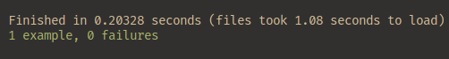
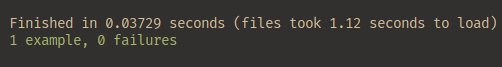
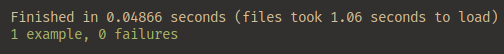
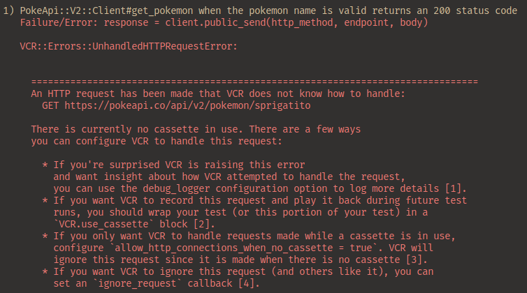

# Wrap and Roll: Wrapping APIs with Faraday and VCR (Part II)

Hello again! In case you feel here and have no context whatsoever, don't worry! This is the final part of a two part blog post, in the [first part]() we learned about Wrappers and how to create them using the _**Faraday**_ gem, today we will learn how to test a wrapper and more generally how to test API calls as a whole.

I'll mainly use _**VCR**_ to test the wrapper, but at the end I'll digress a little about _**Webmock**_ and testing API calls outside the wrapper. Happy reading!

## Intro

We finally created a _Wrapper_!

We can now, in our study case - initiated with [part I]() - save Pokemons, Berries and Items for our _Poke-Adventure_, there is no stopping us now, right? Unfornately not all code is without flaws, and the best way to prevent further problems and correct existing ones - even those that we did not antecipate - is by testing! Testing an external call is actually much simpler!

_**You don't test it.**_

We will test _our_ implementation and if it gets the info that is needed, we won't test the external API _per se_, even though we need it. That's because we shouldn't rely on external services while testing our internal application, we can never know when the service we call is out, is dealing with maintenance or such. That's where the powerful _**VCR**_ gem comes for our rescue - and it's little/big brother _***Webmock***_, even though it's not the focus here.

Let's find out how to use them!

## Why VCR?
VCR is a nice way to guarantee _faster_ and _deterministic_ tests when dealing with external APIs, its main feature is that it allows you to record, in a file, your tests _HTTP interactions_ and later replay them during future tests that use the same request, with it the accuracy of a test involving a request is much higher than, let's say, _mocking_ it by hand - like the way we do with Webmock, more on that later.

This feature is implemented using the ideia of a cassette - yes, those old ones, based on [Video Cassette Recorders](https://en.wikipedia.org/wiki/Videocassette_recorder) - each cassette is a _**yml**_ file containing the data that represents a recorded HTTP interaction between your app and a external service. It records this _request/response cycle_ in a cassette the first time you run a test using a `VCR.use_cassette` block, naming the file and using it the next time the test is run, so it only makes a external request _once_ per named cassette.

This file pertains information about the request you've made, with all its values and the response you got. This data is used for `request matching` during future tests and the response is used for _mocking_ the expected response.

It is really useful to visualize the response you got, it also helps with debugging!

For detailed info check the [offical VCR docs](https://benoittgt.github.io/vcr/#/)!

## Why VCR instead of Webmock? - Or the difference between them

Never heard of Webmock? don't worry, here is a quick explanation:

> Library for stubbing and setting expectations on HTTP requests in Ruby.
>
> <cite> https://github.com/bblimke/webmock </cite>

Well... it does seems similar to VCR, right? Actually, is really different, even though they carry the same idea of stubbing and not relying entirely on external services.

The gist is that both are used to test APIs integrated apps and mock requests and responses (more on that in the next topic), but what is the difference?

So not to get caught up in this cobweb of explanations, both of them guarantee that in a `testing enviroment` all requests are interceptated, so no real outgoing HTTP requests are made out of our control, both also match the request against a pre-registered `stub` (a fake request frame of sorts) and return an equally pre-defined fake response. In the case of VCR this request matching is made against the first request you've made and the response is contained in the _cassette_, but Webmock relies on your knowledge of the API, since in this case there is _**zero**_ outgoing requests at any time, you allow a certain request to be caught and write, manually, the response you want.

```
Webmock: Allow a request by writing what it contains, it compares with request being made and returns a pre-defined, written, response.

VCR: Allows a request to be made once, this HTTP interaction is locally saved, the subsequent requests using the named cassette will be matched with the original request and returns a stubbed response based on the real response you got.
```

That's the main difference, but do not think one is necessarily better than the other, they both have their applications, their pros and cons.

## Pros and Cons of each Gem!

Yes, a whole section to this, believe me, its necessary, it is not uncommon to see a developer that needs to test an API but spend hours trying to decide what fits best when there are two great options that in a way do the same thing. Let's talk about pros and cons of each!

### Webmock 
Webmock allows us to make quicker tests when we don't need a full response or don't want to directly call the API _every single time_. When we deal with an API we have reasonable knowledge about how it works, it can shine. Imagine you are testing a service that eventually calls the API, like our service that was made in the last blogpost! Maybe we just want to make sure that the service called the API and that a request was made, but don't need the real values, in that case Webmock can stub a _request/response cycle_ that accepts the correct HTTP verb and URL, and only returns a status code of 200, so the test is small, simple and effective!

On the other hand there are certain limitations with this approach, first, mocking a request and response can be **really** time consuming, if you try to use Webmock to stub a huge request/response, you'll likely take more than a few moments to guarantee that you response is correct and in pair with a real API response from the service you chose, in the example mentioned before we only talked about a status code, but imagine a response that involves a huge `body` and `header`, awful, right?

It also introduces a problem on maintanance, if the API changes in some way, you'll need to rewrite a lot of code, especially if you have a colossal test suite, and with it you also increase the chance for a false positive or incorrect assumption you've made, yes, an _**assumption**_. To write a response that did not actually happened you have to assume what the response would be, it _represents_ a response, but is not based on a actual one. Issues can escalate if you develop based on false assumptions. 

> Oh, but that is _eaaaaasy_! Just Control + C, Control + V the request/request cycle you made with Postman using the test data and ta-dah! Done. End of the post.
>
> <cite>a smart developer, 2024</cite>


Come one, that is _exactly_ what webmock is trying to prevent... no way that solves the issue!

Well... yes?


That's exactly what the VCR developers thought! - I think, it sure sounds like it.

### VCR
VCR solves the problems cited above, these kind of limitations are where Webmock gets out of the stage and where VCR enters, it allows us to make real HTTP interactions and save them to have a _true_ mock of sorts, it saves us time by not asking us to write exactly what is going to be allowed and by not forcing us to write a response, the stubbed response is based on a real one, so we can have deterministic tests that are not based on a assumption!

But is also comes with some setbacks, first, the _**big one**_, even though its only one time, you _are_ making a real request, the data you submit is most likely to be registered someone out of your application, it also may need authentication, even though it is filtered if you use the right configuration. Depending on how much tests you have, you can make a whole lot of requests and you will need to _store_ them, sometimes you don't need all this, so we go back to the old reliable Webmock. Not all code that in some way will interact with the API - one way or the other - needs a whole cassette for it. 

### Conclusion, but not the last one!

You see? There are some pros and cons, it wasn't a short explanation, but now you know where to use them most of the time!

There is no definitive answer, that is a debate on what is best for each occasion, but for this blog post and maybe as a rule of thumb, use **VCR** when you _really_ want to make sure of a request values in someway, like if you are testing a wrapper, for example, so you know it really is making the correct request! Use webmock for quicker tests and situations where you don't really need all values and confirmations, like a service that indirectly uses the a external call!

Either way here we'll mainly use VCR, but i've left a simple Webmock example before the last and real conclusion.

## Installation

Let's install what we need and set them up!

We will use two gems, `RSpec` and `VCR`, simply add them to your Gemfile

```rb
# Gemfile.rb
group :development, :test do
    # ...
    gem 'rspec-rails', '~> 6.1.0'
    gem 'vcr'
end

```
Now install the gems via bundler and generate the rspec configuration files
```console 
$ bundle install
$ rails generate rspec:install
```

Nice! Now we can setup VCR. Next will go to `spec/spec_helper.rb` and set it up
```rb
# spec_helper.rb

#...

require 'vcr'

#...

VCR.configure do |config|
  config.cassette_library_dir = 'spec/cassettes'
  config.hook_into :faraday
end

```
Here we require VCR to be used in our test and configurate it via a yielded block, that's where you would customize it to your needs, in this case we are just defining where the saved requests will be stored and how VCR will hook into the HTTP requests to record them, in this case it will hook into Faraday. But there are much more that you can do, remember to check the [documentation](https://benoittgt.github.io/vcr/#/) to know what is available!

Some examples of possible configurations are
```rb
  # If you want to allow requests to localhost,
  # like if you are using Capybara
  config.ignore_localhost = true

  # saves the log of a call, it will log debug output to a file, 
  # useful to troubleshoot what VCR is doing
  config.debug_logger = File.open('vcr.log', 'w')

  # If you are also using webmock, this allows for no conflicts, 
  # it lets VCR do its first requests and it also allows you to
  # freely use whichever fits your needs in the moment
  # ---
  # It can hook_into other gems and adapters too
  # check https://benoittgt.github.io/vcr/#/configuration/hook_into?id=hook_into for more info
  config.hook_into :webmock

  # Use this if you want to filter sensitive data so it is censored when saved
  # In this example it identifies the Authorization Header and substitute
  # the enconded the first value that it finds, in this case the secret key
  # ---
  # sk_key_123 --> << Redacted >>
  config.filter_sensitive_data('<< REDACTED >>') do |interaction|
    interaction.request.headers['Authorization'].first
  end
  
```
There is only one more thing left before we start testing!

## Custom API Error

Previously we created a rescue clause in our wrapper to prevent further problems, the idea stays the same, the wrapper will deal with its own errors, wherever you choose to call the wrapper - be it a controller, a service and so on - it should _not_ need to know what an `Unprocessable Entity` or `Resource Not Found` error is, it just need to know that the **_message_** it sent to another class raised a descriptive enough but not hardly detailed error and deal with it. Hard to grasp?

Let's make this simpler, what if instead of not rescuing a `Faraday Error` or rescuing them and just inspecting the error, we captured the specific error and instead raised a _generic_ **API Error** that contains the specific error class and message if needed? To do that let's create a file named `api_error.rb` in `app/errors`, inside it we'll write

```rb 
class ApiError < StandardError
  def initialize(message: nil, faraday_error_class: nil)
    super(message)
    @faraday_error_class = faraday_error_class
  end

  attr_reader :faraday_error_class
end
```
As with all errors, it inherits from `StandardError`, so we can raise it and use its message attribute, it also has a `faraday_error_class` that will save what the specific Faraday Error it raised, e.g `UnprocessableEntityError` - for a more detailed explanation of all the Faraday Error check their [official source code](https://github.com/lostisland/faraday/blob/main/lib/faraday/error.rb) on the subject, or their [errors official docs](https://lostisland.github.io/faraday/#/middleware/included/raising-errors?id=raising-errors).

With this we have an Error that describes what happened - The API had an issue -  but is not overly descriptive of what happened, since a service should not need to know in details what happened, but in case we need the specific error, let's say, for debugging or even to let the user know exactly what happened, we still have access to the error class, you could also compose this class with more info, like the body of the failed response for example.

Now we can also create tests for the services that call the wrapper if we want! We only need to treat the case where an API error is raised!

Let's add the custom error to the wrapper

```rb
def request(http_method:, endpoint:, body: {})
  response = client.public_send(http_method, endpoint, body)
  {
    status: response.status,
    body: response.body
  }
rescue Faraday::Error => e
  raise ApiError.new(
    message: e.message,
    faraday_error_class: e.class
  )
end
```
Everytime we have a 4xx or 5xx the wrapper will rescue the error and raise a generic ApiError with info inside it if we need.

Let's start testing!

## Effectively Testing Our API Wrapper

We'll start by making a simple test to check something really interesting, think of it as a further motivation to keep learning how to do this.

```rb
require 'rails_helper'

RSpec.describe PokeApi::V2::Client do
  subject(:wrapper) { described_class.new }

  describe '#get_pokemon' do
    context 'when the pokemon name is valid' do
      let(:pokemon_name) { 'sprigatito' }

      it 'returns an 200 status code' do
        result = wrapper.get_pokemon(pokemon_name)

        expect(result[:status]).to eq 200
      end
    end
  end
end
```


Nice! The test passed, the funcionality is what we intended, but we did the test without any mocking, and we did for comparison reasons, you see, the test finished in `0.20328`, which _is indeed fast_, but remember, this is a simple `GET` endpoint with only one param, its actually just the access to the endpoint, but imagine that this time could acumulate to multiple tests... What if a test takes _2 seconds_ to run? It is still fast, but with 10 tests? 20? You see the problems here? We'll later compare the time, hang on.

Let's create our first cassette!

To do it we just need to isolate our external call inside the `VCR.use_cassette('cassette_name')` block! The HTTP interaction will be stored where you'd set the location to be saved, in our case `spec/cassettes`

```rb
it 'returns an 200 status code' do
  result = VCR.use_cassette('successful_get_pokemon') do
    wrapper.get_pokemon(pokemon_name)
  end
  expect(result[:status]).to eq 200
end
```
That's it, we made the request the first time we run it, it will make the real request and save it, it created a file named `successful_get_pokemon.yml` inside of `spec/cassettes`

```yml
---
http_interactions:
- request:
    method: get
    uri: https://pokeapi.co/api/v2/pokemon/sprigatito
    body:
      encoding: US-ASCII
      string: ''
    headers:
      User-Agent:
      - Faraday v2.9.0
  response:
    status:
      code: 200
      message: OK
    headers:
      date:
      - Fri, 22 Mar 2024 13:56:10 GMT
      content-type:
      - application/json; charset=utf-8
      ...
    body:
      encoding: UTF-8
      string: '<< JSON BODY HERE >>'
  recorded_at: Fri, 22 Mar 2024 13:56:10 GMT
recorded_with: VCR 6.2.0
```

I've shortened the values and removed the whole body, if you test it yourself you'll se that the file is actually pretty big, you can check the real file in the source code [here](). As you can see, it recorded the HTTP interaction and made it readily available! Everything is clearly depicted in the file, body, headers and other params, if you filtered an information, it would appear filtered there as well.

Now that we have recorded the interaction, let's run the test again!



Oh, look at that, the test stil passes, but the time spent on it is _much shorter_, only `0.03729`! That's a _**80%**_ reduction in time! That's huge! Imagine it it was a test that took 2 seconds.. if the decrease was something like 70-80% it would only take 0.4 seconds instead. This is a powerful tool indeed.

Let's keep going!
```rb
let(:hash_keys) { %i[name height weight] }

it 'returns a body with pokemon name, height and weight' do
  result = VCR.use_cassette('successful_get_pokemon') do
    wrapper.get_pokemon(pokemon_name)
  end
  expect(result[:body]).to include(*hash_keys)
end
```
This is also finished in



Fast, right? We even used the same cassette, so we don't always need to register new cassettes!

What about negative responses? 4xx or 5xx for example? We can also test and store the interaction

```rb
context 'when the pokemon name is invalid' do
  let(:pokemon_name) { 'antedeguemon' }

  let(:get_pokemon) do
    VCR.use_cassette('failed_get_pokemon') do
      wrapper.get_pokemon(pokemon_name)
    end
  end

  it 'raises an api error' do
    expect { get_pokemon }.to raise_error(ApiError)
  end
end
```
Let's see the stored interaction again

```yml
---
http_interactions:
- request:
    method: get
    uri: https://pokeapi.co/api/v2/pokemon/antedeguemon
    body:
      encoding: US-ASCII
      string: ''
    headers:
      User-Agent:
      - Faraday v2.9.0
  response:
    status:
      code: 404
      message: Not Found
    headers:
      date:
      - Fri, 22 Mar 2024 15:15:10 GMT
      content-type:
      - text/plain; charset=utf-8
      ...
    body:
      encoding: UTF-8
      string: Not Found
  recorded_at: Fri, 22 Mar 2024 15:15:10 GMT
recorded_with: VCR 6.2.0

```
We forced a 404 response, stored it and successfully treated the error, nice! Also, we can see the difference between the first request and the subsequent one again

```
First call: Finished in 0.20219 seconds

Second call: Finished in 0.03793 seconds
```
If we want to test the other resources we just need to follow the same pattern, if you want to see how they were done, check the [source code]()

### What about making a request without VCR?

That's simple, they aren't allowed.

VCR disables requests outside its blocks so to prevent unwanted behaviour, Webmock also has the same behaviour, if you're curious! If we tried to make the same tests as before without the `VCR.use_cassette` block we end up with the error `VCR::Errors::UnhandledHTTPRequestError`




Of course there is a way to disable this behaviour, let's explore it in the next section about further configuration for VCR

## Further Configurations

There is way to customize the `use_cassette` blocks! You just need to pass some params to it, let's see some options! Click on them to see detailed explanation

```rb
VCR.use_cassette('test', *options_hash_goes_here) do
  # ...
end
```

### Some useful options
_**:record**_ => Defines the way the HTTP interactions is recorded 
  * [:all](https://benoittgt.github.io/vcr/#/record_modes/all), [:none](https://benoittgt.github.io/vcr/#/record_modes/none), [:new_episodes](https://benoittgt.github.io/vcr/#/record_modes/new_episodes), [:once](https://benoittgt.github.io/vcr/#/record_modes/once)

[_**:re_record_interval**_](https://benoittgt.github.io/vcr/#/cassettes/automatic_re_recording?id=automatic-re-recording) => Defines the validity of a cassette, after the time expires it re-record the interaction

_**:serialize_with**_ => Defines the format in which interaction will be stored
  *  :yaml, :syck, :psych, :json or any registered custom serializer. Defaults to :yaml.

### Disabling

And to _wrap up_, to disable VCR somewhere you can make the request inside a `turned_off` block like
```rb
VCR.turned_off do
  # make the request
end
```
This way no error will be raised, or you can use the _bang_ version `VCR.turn_off!` to disable from that point foward and later turn it back on with `VCR.turn_on!`

## What about Webmock?
Let's just quickly grasp at how different a webmock call would be. I won't show the setup or configuration, since it's not the focus here, this section is only meant to clench your thirst for knowledge.

I'll use the same test as before, to test a status code and response body, using webmock we would have
```rb
context 'when the pokemon name is valid with webmock' do
  before do
    VCR.turn_off!
    stub_request(:get, 'https://pokeapi.co/api/v2/pokemon/sprigatito')
      .to_return(
        status: 200,
        body: {
          name: 'sprigatito',
          height: 25,
          weight: 5
        }.to_json
      )
  end

  let(:pokemon_name) { 'sprigatito' }

  let(:hash_keys) { %w[name height weight] }

  let(:get_pokemon) do
    wrapper.get_pokemon(pokemon_name)
  end

  it 'returns an 200 status code' do
    result = get_pokemon
    expect(result[:status]).to eq 200
  end

  it 'returns a body with pokemon name, height and weight' do
    result = get_pokemon
    expect(result[:body]).to include(*hash_keys)
  end
end
```
See? We had to manually write the request and response, of course, this is a small example, but in a bigger request it would be a problem to write and assume the values (notice that I've just used a random number for both weight and height), also notice how I needed to convert the body to json and the response did not returned parsed, so the keys had to be checked as strings. In this case I would highly recommend the usage of the VCR gem, but do not think Webmock is useless, on the contraire! 

## Conclusion

Today we learned what is VCR and why we are using it, also we explored the differences between VCR and Webmock, we learned that their usage _depends_ on each occasion, with their pros and cons. As said in the first part of this two-part blog post, you don't need to memorize all this, just to understand what you are reading and consult the documenation when needed, if you read both parts of this blog series you have successfully added some tools to your toolbox! Keep on studying and testing, your life is now a little easier with Faraday and VCR.

> Somewhere, something incredible is waiting to be known.
>
> <cite> Sharon Begley on Carl Sagan profile, Newsweek Magazine, 1977</cite>

Cover Photo from <a href="https://unsplash.com/pt-br/@micrinski?utm_content=creditCopyText&utm_medium=referral&utm_source=unsplash">Michael Dobrinski</a> @ <a href="https://unsplash.com/pt-br/fotografias/homem-tocando-bateria-JxufJsFmvW0?utm_content=creditCopyText&utm_medium=referral&utm_source=unsplash">Unsplash</a>
  